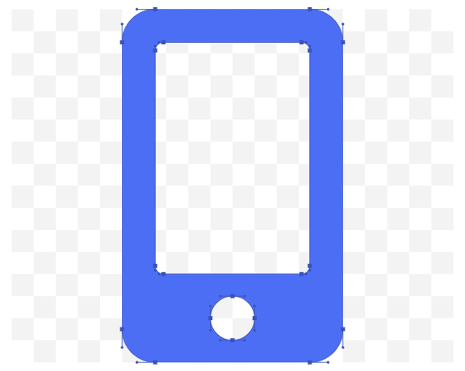

<!DOCTYPE html>
<html>

<head>
    <meta charset="utf-8">
    <meta name="viewport" content="width=device-width, initial-scale-1.0">
    <title>Shoaib Qur</title>

    <link rel="stylesheet" type="text/css" href="style.css">

</head>

<body>
    <main>

        
Shoaib Qureshi

        

            <li id="bio" onclick="bioName ();">Bio</li>
            <li>Portfolio</li>
            <li>Blog</li>
            <li>Contlict</li>
        

        

            
Hello

            
I,m

            
Shoaib Qureshi

            
Web Developer & Retailer

            

                <button id="hire" onclick="bioName ();">Hire Me</button>
                <button id="hire" onclick="contMe ();">Contact Me</button>
            

        

        

            
            

        

        

            
Address: Mahim, Mumbai,
                Contact: +91
                    9167-553-218
            

            

                

                

            

        

    </main>

    

</body>

</html>
